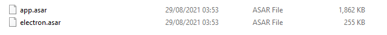

# MetaCTF 2021

## Source Code Shipping

>Ever wondered what was in those absolutely massive desktop apps such as Slack, Discord, and other apps built using Electron JS? Well we've created a small Electron-based app with a flag embedded in its source code for your perusal.
>
>You don't need to install or run the app to get the flag.

### Analysis

We were given a file names `Setup.exe` then we extracted the file to check what is inside of it which will give use a folder named Setup and here is what inside of it.

And inside the folder there is nothing interesting except the `nupkg` file so we searched what `nupkg` file is. As it turns out `nupkg` file is a code package used by NuGet used to create and share packages for use in .NET projects.

So we tried to extract the `nupkg` file to see the source code inside of it, and here are inside of the file.

Then we tried searching of what is inside all of these file. Which then when we opend the lib folder we found a folder named `net45` which contained an `exe` file.

But the other files were just a bunch of `dll` extension and folders and it was said that we don't need to run the file so then we checked we moved and tried to check what is inside those folders.

We first opened the resources folder which then we found a file named `app.asar` and `electron.asar`

Which the name correspond to the problems description, we opened the `app.asar` first and there is a comment which said `THE FL@G is right below this message!!` and the strings below it looks like a base64 so we tried to decrypt it.

We decrypted it using CyberChef and there we found that the decrypted string is the flag we've been looking for.

Flag : `MetaCTF{you_completed_A_Search_And_Rescue_the_flag_mission}`
