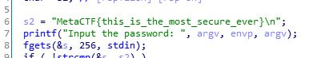

# MetaCTF 2021

## There Are No Strings on Me

>We've got this program that's supposed to check a password, and we're not quite sure how it works. Could you take a look at it and see about finding the password it's looking for?

### Steps

At first we were given a file named `strings`. So we ran `file` to know what type of file that is.

`ELF 64-bit LSB pie executeable`

So then we checked the file from IDA Pro and then boom we found the flag right inside the source code.

Flag: `MetaCTF{this_is_the_most_secure_ever}`
  
