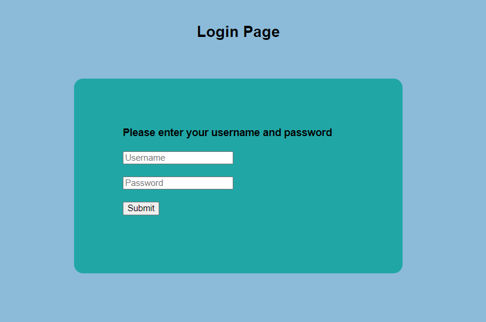
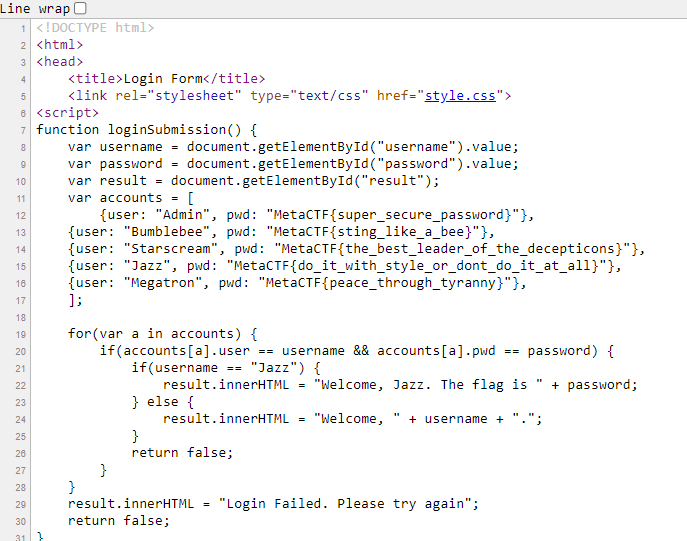

# MetaCTF 2021

## Under Inspection

>Someone made this site for the Autobots to chat with each other. Seems like the Decepticons have found the site too and made accounts.
>
>One of the Autobot accounts has a flag that they're trying to keep hidden from the Decepticons, can you figure out which account it is and steal it?

### Steps

At first we were given a link to a website which shows a login page

With the clue of the name that is Under 'Inspection', We checked the page source.

Here we found a lot of flags but witch one is the right flag? So we read the code belom and we see if the username is Jazz the will print out the flag. So we know that the correct flag is Jazz's

Flag : `MetaCTF{do_it_with_style_or_dont_do_it_at_all}`
